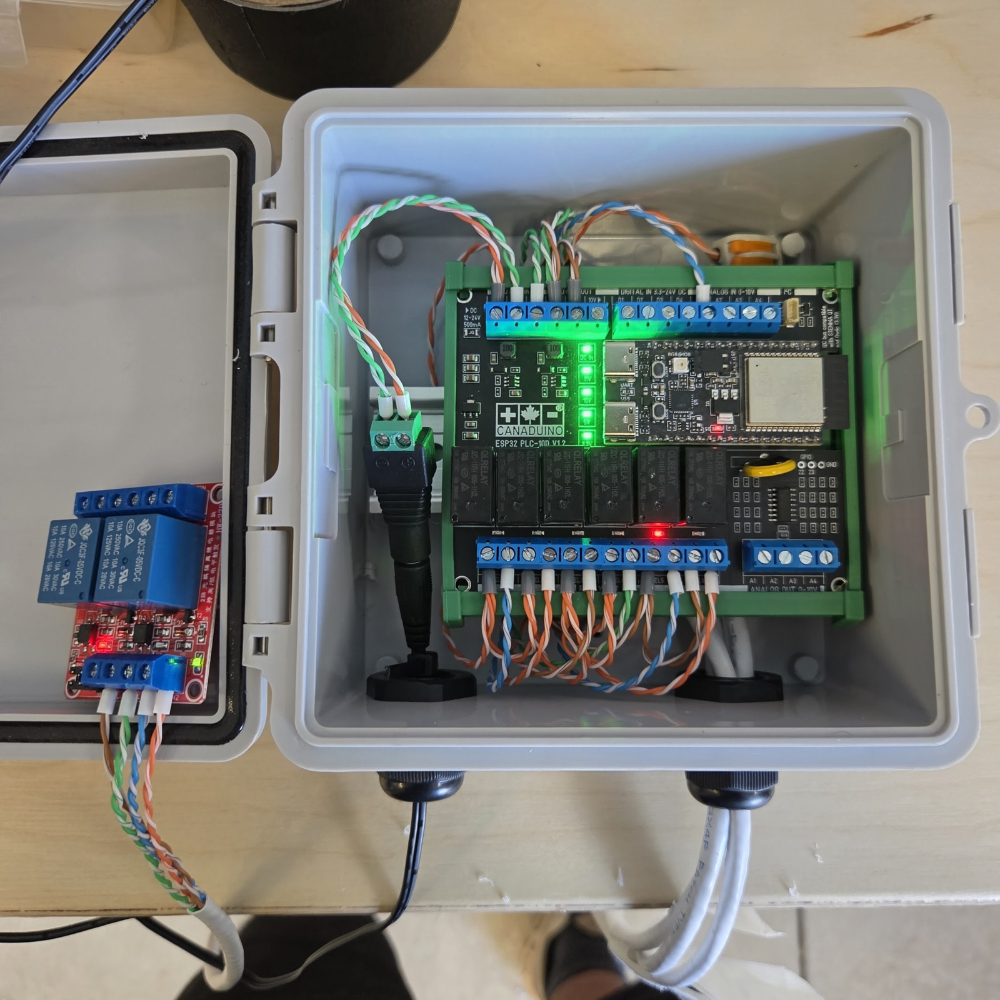

# Pump Monitor

ESPHome firmware for an irrigation pump node: an **ESP32-C6-DevKitC** seated in
a **Canaduino ESP32 PLC-100 V1**, driving two motorized 1/2" stainless ball
valves and a pump enable relay through the board's relays, and reading a
pressure transducer. Each valve appears in Home Assistant as a native `valve`
entity with a 0–100% position slider — and **position means calibrated flow
percent, not ball rotation** (see [Flow calibration](#flow-calibration)) — plus
an incremental **Pulse Position** for fine trims.

## Hardware

| Component | Detail |
|---|---|
| Controller | ESP32-C6-DevKitC-1 on Canaduino ESP32 PLC-100 V1 |
| Valve 1 | REL1 (close) / REL2 (open) — PCA9557 IO1/IO2 |
| Valve 2 | REL3 (close) / REL4 (open) — PCA9557 IO3/IO4 |
| Pump ICE enable | REL5 or REL6 (selectable) → external Songle 2-relay module, NO contact in line with pump control wiring |
| Pressure | 1–5 V ratiometric transducer, 0–100 psi, on AI1 (GPIO0, ~3:1 divider). Calibrated to the transducer spec (dial gauge read ~8 psi higher; transducer trusted — absolute psi is a reference, the trace shape is what matters) |
| Pump switch | Furnas Class 69 pressure control with auto-off lever, in the 120 VAC starter loop: **Pump → Furnas → ICE relay** in series. Low-pressure cutoff 20 psi handles low pressure (with the starter's thermal overloads behind it). It has no high setting — the ICE is the only high-pressure guard |
| Relays | PCA9557 I2C expander @ 0x1A → ULN2003 (IO1..IO6; IO0 unused) |
| I2C | SDA=GPIO6, SCL=GPIO7 (DS3231 RTC @ 0x68 shares the bus) |
| Valves | 1/2" SS motorized ball valve, ~3.55 s travel, internal end-stop switches |
| Power | 12–24 V on the board supply terminals (relay coils from onboard 5 V buck) |
| Pump | Goulds 3656 S-Group 1½ × 2 – 6, 5-15/16" impeller, WEG 5 HP 1-ph 3490 RPM. Pond suction is flooded by only **~1 ft** (the pump sits 1 ft below the pond surface; the intake is 10 ft below the pump but intake depth doesn't add head — the free surface does), so the gauge reads curve-head **+ only ~0.4 psi**. Published curve at the gauge: **shutoff ~65 psi**, best efficiency (~73%) **~52 psi @ ~100 GPM**. Pump off should read ~0.4 psi (≈0). **Caveat: measured efficiency is ~49% (see TODO), so the real curve likely sits below published — measure actual dead-head before trusting these.** 4" irrigation main (150 psi rated), 1¼–1½" lawn lines |

The actuators have internal end-stop limit switches, so driving past full
travel is harmless — the firmware exploits this to re-home on every move.



*The build: ESP32 PLC-100 V1.2 on DIN rail in a weatherproof enclosure, 12 V
barrel-jack supply, CAT5 pairs from REL1–REL4 to the valves, REL5/REL6 to the
Songle 2-relay ICE module mounted in the lid, pressure transducer on AI1,
cable glands for the field runs.*

## How positioning works

The valves have no position feedback; position is dead-reckoned by motor
run-time. To keep that accurate:

1. **Every move re-homes at FULL OPEN** (drive open for travel + 0.25 s;
   the end-stop absorbs the overrun). The pump never gets dead-headed
   mid-move — the transient is extra flow, never zero flow.
2. The firmware then **close-pulses down to the target** using the flow
   table. Every position is approached from the same direction, so gear
   backlash cancels.
3. **Position 0% is the exception**: it drives the ball hard onto the seat
   (full close). *Only command 0% with the pump off.*

A 20 s dead-man timer forces the valve relays off if anything (including a
lost Wi-Fi/HA connection) leaves one energized.

### Pulse Position (incremental mode)

Each valve also has a **Pulse Position** number (0–16) for small trims
without the full re-home cycle — the primitive for pressure control
("pressure high → +, pressure low → −"). Counter semantics:

| Counter | Ball position |
|---:|---|
| 0 | seated (hard on the end-stop) |
| 1 | breakaway pulse (travel − 3.0 s ≈ 0.55 s) — water-zero, flow ≈ 0 |
| 2 … 15 | +0.2 s of open travel per count |
| 16 | full open (= full travel) |

The **Pulse +** / **Pulse −** buttons step the counter by one (automations:
`button.press`); each press advances the last *requested* target, so rapid
presses accumulate correctly. The **Pulse Target** number jumps straight to
N. Either way the valve moves from its current counter to the target in one
continuous pulse (open or close).
Pulse moves are dead-reckoned (no re-home) so error accumulates; any move
on the flow slider re-homes and resyncs the counter, and pulse moves update
the valve's reported flow %. Counter and position survive reboots (the ball
doesn't move when the ESP restarts).

**Reboot behaviour.** All relays are commanded OFF at boot and nothing moves
the ball. Reported positions are seeded at boot from restored globals,
because ESPHome's `Valve::position` is an uninitialized float — without the
seed, a first boot after a flash reports RAM garbage (clamped to 1.0 =
"open"), which is what once looked like "the valves opened on reboot".
Diagnosed 2026-08-23 from the pressure history: no dip at boot, dips only
during the manual closes that followed.

Power-on is also clean: the PCA9557 comes up all-inputs with 100 kΩ
pull-ups, but the ULN2003's built-in input network (2.7 kΩ series + 7.2 kΩ
base-to-ground) holds each driver input at ~0.3–0.45 V — well below the
~1.4 V a Darlington needs — so the relays cannot pull in during boot.
Relays are commanded OFF the moment ESPHome configures the expander.

### Per-valve calibration constant

Each valve's **Full Travel Time** is a number entity in HA (default 3.55 s).
Everything scales from it at runtime — swapping in a replacement valve of the
same model only requires measuring its travel (seat test: drive closed onto
the seat, then time open-to-endstop) and typing the number into HA. No reflash.

## Flow calibration

On a ~60 psi static supply (city faucet ≈ the irrigation pump), the installed
flow curve of these ball valves is extremely nonlinear: **~10% of ball travel
already passes over half of max flow, and everything above ~35% travel is
plateau**. All real control authority lives in the first quarter of rotation.

The firmware therefore maps commanded flow % → ball position through a
measured table (`VM_OPEN_FRAC` in `valve_math.h`), built with a bucket test
(2026-08-17, 30 s holds, constant-transient protocol):

| Flow % | Ball position (fraction of travel from seat) |
|---:|---:|
| 0 (water-zero) | 0.141 |
| 5 | 0.197 |
| 10 | 0.225 |
| 15 | 0.254 |
| 25 | 0.275 |
| 50 | 0.34 *(provisional)* |
| 80 | 0.43 *(provisional)* |
| 95 | 0.53 *(provisional)* |

Anchors ≤25% are solid (trickle-sweep measurements). The 50–95% anchors are
converted from an earlier sweep with a contaminated blank — re-verify with
clean bucket runs (see TODOs). Note the valve has *two* zeros: water stops at
~0.14 of travel (water-zero); the mechanical seat is further (seat-zero).

### Calibration procedure (for a new valve or supply)

1. Measure **Full Travel Time** (seat test) and set the HA number.
2. **Blank run**: command position 0, run the bucket protocol — the weight
   is tare + transient water (the constant to subtract from every trial).
3. Sweep positions with fixed hold times, weigh the bucket each run.
   Flow fraction = (weight − blank) / (max-flow weight − blank).
4. Update the `VM_OPEN_FRAC` anchors in `valve_math.h`.

## Home Assistant entities

- **Valve 1 / Valve 2** — native valve entities: position slider (= flow %),
  open / close / stop buttons
- **Valve N Pulse Position** — integer sensor, the 0–16 pulse counter
  (see above); **Valve N Pulse +** / **Pulse −** buttons step it, and the
  **Valve N Pulse Target** number (config category) jumps straight to N
- **Pump Pressure** (psi) and **Pressure Sensor Voltage** (diagnostic, for
  calibration trimming)
- **Valve N Full Travel Time** — per-valve calibration constant
- **Valve N Open/Close (RELx)** switches — raw relay diagnostics
- **Valve N Elapsed / Last Open Time / Last Close Time** — motion
  diagnostics (verify positioning pulses without log access)
- **ICE** — the pump's in-case-of-emergency protection. The pump runs on a
  *latching* starter loop: one break = pump off until a manual restart. So
  the loop is opened **only on a latched pressure trip**, never by a reboot
  or a switch. **Control Wiring Relay** is a read-only sensor of the loop
  itself (ON = closed / pump enabled, OFF = open / tripped); **ICE Bypass**
  is the mode switch:
  - **ON = bypass**: loop held closed unconditionally (work on the board,
    reboot, swap a valve). Default; remembered across reboots.
  - **OFF = automation armed**: the relay is a debounced comparator with
    hysteresis, like the Furnas itself — **closed while Low Trip < pressure
    < High Trip**, open otherwise. 3 s at/above High Trip (default 65 psi — above the ~57 psi best-
    efficiency point with margin, 5 psi below the pump's ~70 psi dead-head
    at the gauge)
    opens it — the ICE is the pump's **only high-pressure protection**: the
    Furnas only does low, and a dead-headed centrifugal pump draws *less*
    current, so the thermal overloads never see it. High Trip must sit
    below the pump's shutoff head; Low Trip defaults to
    **0 = disabled** because low pressure is the Furnas's job (20 psi) with
    the starter's thermal overloads behind it. (Set Low Trip > 0 to add a
    5 s low-side trip.) Then 2 s back inside the band re-closes it. Every opening
    latches an alert (**ICE Tripped**, reason in **ICE Status**) until
    **ICE Reset** — the alert is the record, the loop state just follows
    pressure. A sensor fault (transducer outside 0.7–5.3 V) holds the
    current state and never opens the loop.
  - **Starting the pump**: the starter is HAND–OFF–AUTO. Start in HAND
    (circuit bypassed); once at pressure the relay is already closed, so
    flipping through OFF to AUTO hands the pump to the circuit. The blip
    through OFF doesn't trip anything — pressure stays above 20.
  - **After a trip**: pump stops, pressure decays, loop stays open (status
    shows it). Restart in HAND; as pressure passes Low Trip the relay
    re-closes on its own; flip to AUTO. If the cause persists it simply
    trips again.
  - **ICE Test Mode**: the trip logic runs and reports "TEST: would trip …"
    in ICE Status but never actuates the relay — lower the High Trip and
    close the main valve slowly to prove it with zero risk.
  - **Control Wiring Relay Select** picks REL5 or REL6 (spare swap without a
    reflash); changes are make-before-break.
  - **Wiring: NO contact, relay energized = loop closed** (decided
    2026-08-18, fail-stop: if the control board loses power it can no longer
    monitor pressure, so the pump stops). `ice_run_energized: "true"`.
    Reboots and OTA do **not** blip the relay: the PCA9557 keeps its
    outputs through an ESP reset, and the local `components/pca9554`
    override preserves them at init instead of ESPHome's stock
    all-outputs-low initialisation.
  - **Feedback is pressure, not a contact**: the loop is 120 VAC and the
    transducer already reports the truth — no pressure, no pump. **Pump
    Running** (> 10 psi) is the derived state. After a trip, if the pump is
    still running 120 s later the relay didn't open the loop → **ICE Trip
    Failed** and "TRIP FAILED … swap selector" in ICE Status. (Until the
    module is actually wired into the pump loop, every trip test will
    report TRIP FAILED — that's the check working.)
  - The valve dead-man timer and STOP All never touch these relays.
- **STOP All** — valve relays off immediately (does not touch the ICE
  relay); **Restart** — reboot the ESP; **ICE Reset** — clear a latched trip
- WiFi RSSI, IP Address, WiFi Network, Uptime

## Building & uploading

Secrets never live in the YAML — `upload.sh` parses `secrets.h` and injects
them as ESPHome substitutions:

```sh
cp secrets.example.h secrets.h   # then fill in values
./upload.sh pump-monitor.yaml    # OTA to DEVICE_IP_PUMP_MONITOR from secrets.h
./upload.sh home-controller.yaml # each config resolves its own board
./upload.sh pump-monitor.yaml 192.168.4.1   # explicit device (recovery)
DRY_RUN=1 ./upload.sh pump-controller.yaml  # show the target, flash nothing
```

The config comes first and selects the board (`DEVICE_IP_<CONFIG>`), so
with three boards a config can't land on the wrong one — ESPHome OTA does
not check node names. Note: mDNS may not resolve on your network (it
doesn't on DD-WRT) — use the device IP or the router's DNS name
(`pump-monitor`).

**Flashing rule: no zone running.** This is a PLC driving real equipment
(a pump is ~$10K), not a website — the rule is deliberately simple and only
rests on what has been verified. Before any `./upload.sh`, check the
dashboard: no lawn zone running (pump lawn 19:00; home lawn 07:00 / 19:00
on its days), and once Field A is automated, no Field A zone either. Wait
for the cycle to finish. Also don't flash within a minute of toggling any
relay switch — restored states are flushed to flash on a 60 s interval.

What sits behind the rule (verified vs. inferred):

- **Verified 2026-08-23 (bench, pump-monitor):** the ICE relay holds through a
  Restart — the PCA9557 keeps its outputs across the ESP reset and the local
  `components/pca9554` override preserves them at init. OTA is the same soft
  reset. The CVs are motorised ball valves: unpowered they hold position and
  nothing moves them at boot. So a pump-monitor OTA under load costs a few
  seconds of pressure samples — but the rule above still applies; keep it
  boring.
- **Known loss:** lawn zones are 24 VAC solenoids (power = open) and their
  relays are `ALWAYS_OFF`; the sprinkler cycle does not survive a reboot. An
  OTA mid-cycle slams the zone shut and loses the cycle, its timers and that
  start's RTC stamp.
- **Inferred, NOT yet verified:** the Field A line relays
  (`RESTORE_DEFAULT_OFF`) should ride through an OTA by the same expander
  mechanism. Nothing is wired to them yet. Until it is bench-verified on
  pump-controller (TODO §4), treat a running Field A line like a lawn zone.

If Wi-Fi is unreachable the device broadcasts a fallback hotspot
(`Pump-Monitor`, password = `AP_PASSWORD`) — connect and reach it at
192.168.4.1 to recover or OTA.

To rotate the OTA password: set the new value in `OTA_PASSWORD`, add
`#define OTA_OLD_PASSWORD "<current device password>"`, run `./upload.sh <config>`
once (it compiles the new password in while authenticating with the old),
then delete the `OTA_OLD_PASSWORD` line.

## TODO

See [TODO.md](TODO.md) — including the staged pressure-response design
(Green / Yellow / Red / DEFCON 1) that will replace the flat ICE threshold.

## Repo files

- `pump-monitor.yaml` — production firmware (two valves, ICE relay, pressure)
- `valve_math.h` — flow↔position table and pulse-counter math shared by
  both valves and both positioning modes
- `components/pca9554/` — local override of ESPHome's expander driver that
  preserves relay states across reboot/OTA (keeps the ICE loop closed)
- `pump-controller.yaml` — 2nd C6/Canaduino board: the 2 lawn zones as a native ESPHome `sprinkler:` controller (valve_open_delay, Next/Run-Zone buttons, elapsed/remaining timers), Field A lines as plain relay switches for a future coordinating "brain", DS3231 RTC as a time source, `RTC Zone N` timestamp sensors stamped at every zone start
- `pump-monitor-proof-of-concept.yaml` — single-valve bench-calibration rig this project grew
  out of (still what shipped the calibration data)
- `upload.sh` / `secrets.example.h` — secret-free build workflow
- `docs/sprinkler-component-notes.md` — ESPHome sprinkler component reference for the lawn/zone node
- `docs/fields.md` — irrigation field layout and head counts per line/zone
  (source sketches and satellite photos live in the local, gitignored `images/`)
- `TODO.md` — open work and the staged pressure-response design
- `tools/ha_pressure.py` — pulls Pump Pressure history from the HA recorder (read-only over ssh) and prints sustained plateaus, for logging line/zone pressures

## License

MIT
